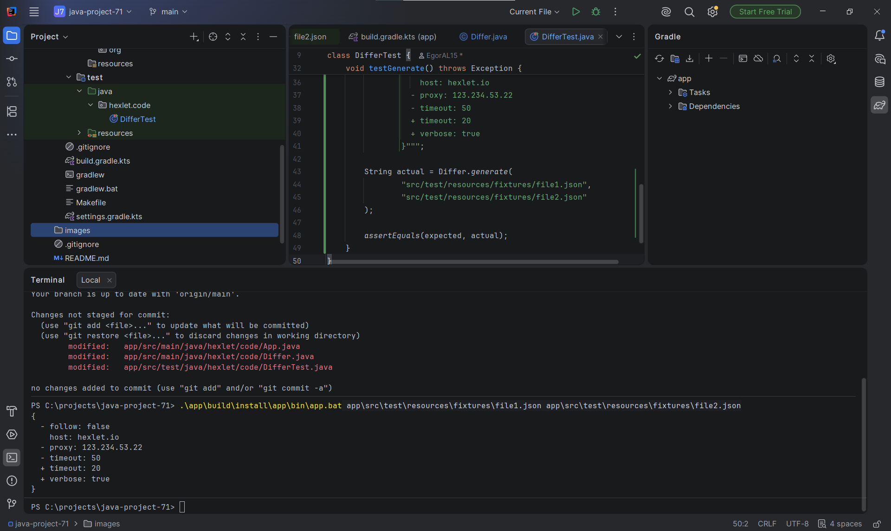
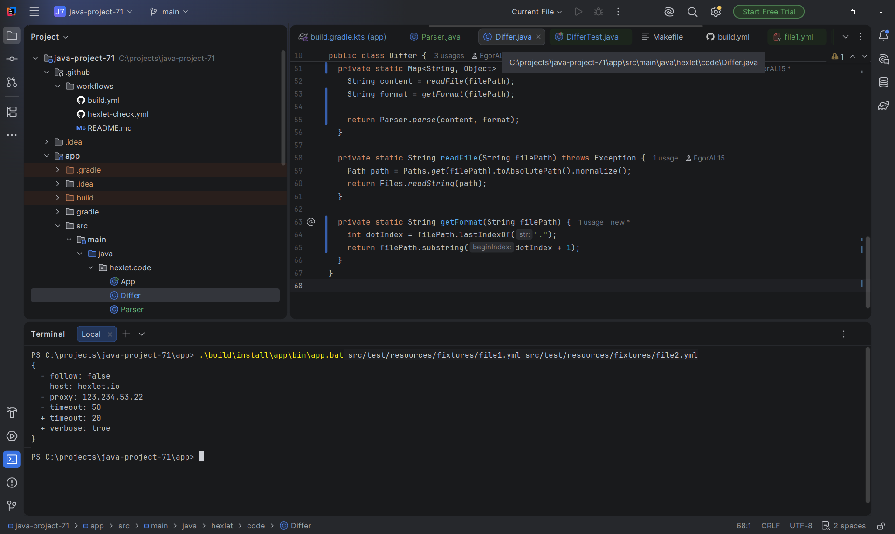
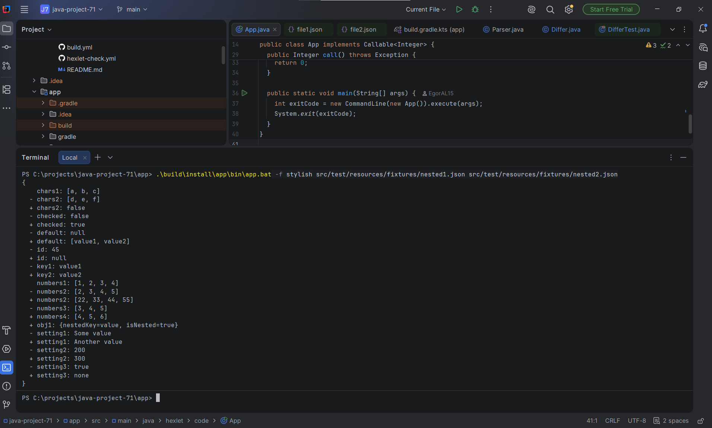
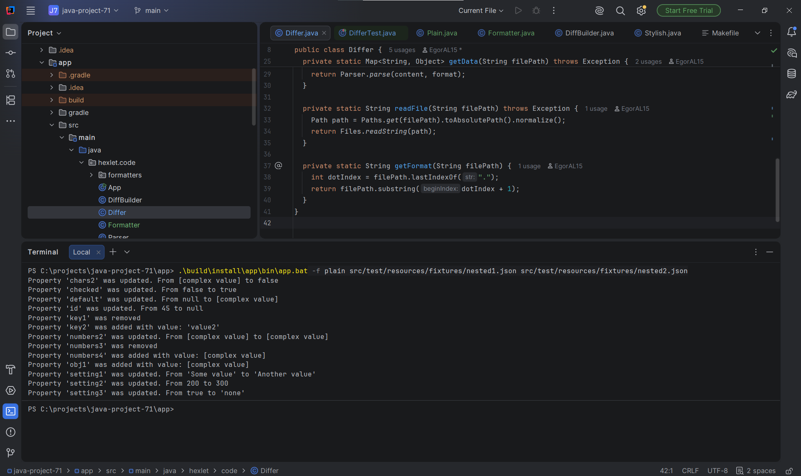

# Вычислитель отличий (Java)

[](https://github.com/EgorAl15/java-project-71/actions)
[](https://github.com/EgorAl15/java-project-71/actions/workflows/build.yml)

В этом проекте отрабатывается работа с коллекциями и структурами данных. Изучаются способы построения и обхода деревьев. Вы познакомитесь с разными форматами данных (json, yml), научитесь их парсить и формировать. Начнете писать тесты (JUnit) и освоите разработку через них. Познакомитесь с непрерывной интеграцией (CI) и элементами экстремального программирования (XP). Прокачаете ООП мышление.

Учебный проект Хекслета: https://ru.hexlet.io/programs/java
Как это должно работать: https://asciinema.org/a/NFIQgLVMu1ymFsqg4ESeOQeXi

## Стек

- Java

## Установка

<!-- Опишите установку: клонирование, зависимости, переменные окружения -->

```bash
git clone https://github.com/EgorAl15/java-project-71.git
cd java-project-71
```

## Использование

<!-- Добавьте примеры запуска и запись asciinema — именно это смотрит работодатель -->


### Сравнение YAML-файлов


### Формат stylish


### Формат plain


<details>
<summary>Автоматические тесты Хекслета</summary>

Тесты запускаются на каждый коммит. За запуск отвечает файл `.github/workflows/hexlet-check.yml` — не удаляйте и не переименовывайте ни его, ни репозиторий.

</details>

## О Хекслете

[Хекслет](https://ru.hexlet.io/) — школа программирования: авторские программы обучения с практикой, поддержкой наставников и реальными проектами, которые остаются в резюме. Этот репозиторий — один из таких проектов.
